# Data-Simulation-Project
"Data Simulation Project: Use of Procalcitonin Assays to Predict Serious Bacterial Infection in Young Febrile Infants"
----------------------------------------------------------------------------------------------------------------------

#### Tanzir Hasan

  **Reference Link:**
<http://saludesa.org.ec/biblioteca/PEDIATRIA/PROCALCITONINA_MEJOR_PREDICTOR_DE_BACTEREIMA_EN_NI%C3%91OS.pdf>

#### Introduction

This data simulation project try to simulate the variables studied in
the main article. In the main article the researchers explored the the
diagnostic characteristics of procalcitonin(PCT) assay,C-reactive
protein (CRP) concentration, white blood cell (WBC) count, and absolute
neutrophil cell (ANC) count for detecting serious bacterial infection
(SBI).

#### Study design , Setting and Participants described in paper

This study is a prospective cohort study that included infants aged 7- 9
days admitted to 15 French pediatric emergency department for a period
of 30 months.

#### List of variables

-   Age in days
-   Sex
-   Febrile family member
-   C-reactive protein(CRP)  
-   procalcitonin(PCT)  
-   WBC(white blood cell)  
-   Temperature
-   YOS score
-   ANC(absolute neutrophil cell)
-   diagnosis
-   infection\_type

<!-- -->

    N= 2047 # sample size
    set.seed(123)
    # Age in days 
    # age of patients between 7 to 91 days
    age <- round(runif(N ,7,91))
    sum(age<=30)/N

    ## [1] 0.2794333

    hist(age, col = "blue")

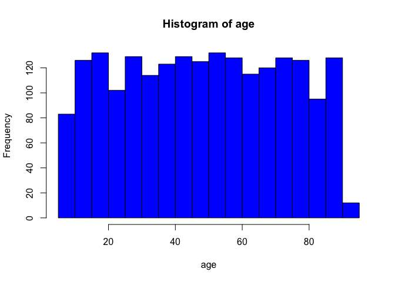

    # Sex- male-59.5%(1218)
    sex <-as.factor(sample(c("male", "female"), N, replace=TRUE, prob=c(0.595, 0.405)))
    sum(sex=="male")/N

    ## [1] 0.5818271

    table(sex)

    ## sex
    ## female   male 
    ##    856   1191

    #Temperature 38 and above higest 40
    Temperature <- sample(seq(38,40,0.125),N,replace=TRUE)
    hist(Temperature, col = "red")

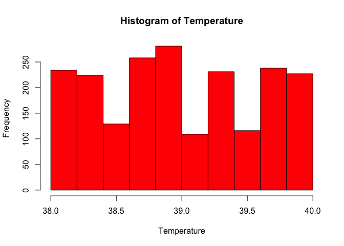

    # Febrile family member(27%)

    Febrile_family_member <- sample(c("YES", "NO"), N, replace=TRUE, prob=c(0.27, 0.73))

    #PCT( procalcitonin )
    set.seed(123)
    PCT <- rnorm(N,100,70)  *.15  /100
    ind <- which (PCT<0)
    PCT[ind] <-  -1 * PCT[ind]* .1  +0.018
    mean(PCT)

    ## [1] 0.1580383

    sum(PCT >=0.3)/N

    ## [1] 0.07816317

    hist(PCT,breaks = 50,col="blue")

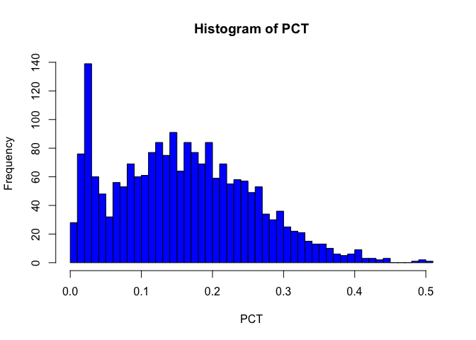

    # YOS score( Yale Observation Scale ) # will be more than 10 when patient have severe infection
    YOS <- PCT * 33.33
    hist(YOS, col='red')

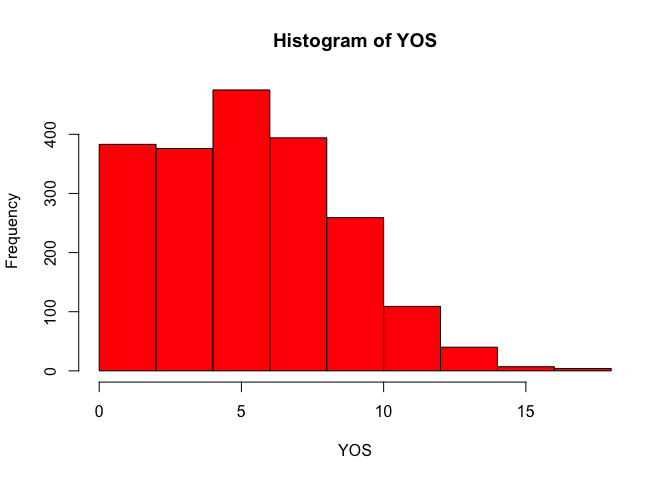

    sum(YOS >=10)/N

    ## [1] 0.07816317

    set.seed(123)

    # CRP( C-reactive protein ) cut off for 20mg/L, CRP levels may increase from less than 50 μg/l to more than 500 mg/l,
    CRP <- PCT * 66.66
    sum(CRP>=20)/N

    ## [1] 0.07816317

    hist(CRP, col = "orange")

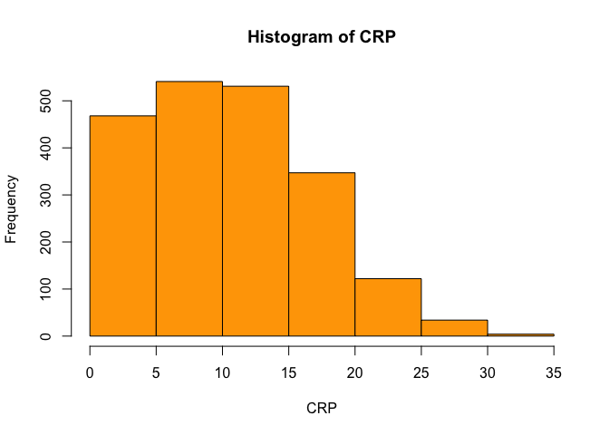

    # WBC(white blood cell) >= 10,000
    set.seed(1)
    WBC <- rpois(N, lambda = 10000) # As WBC is  count data so rpois used
    hist(WBC,col="green")

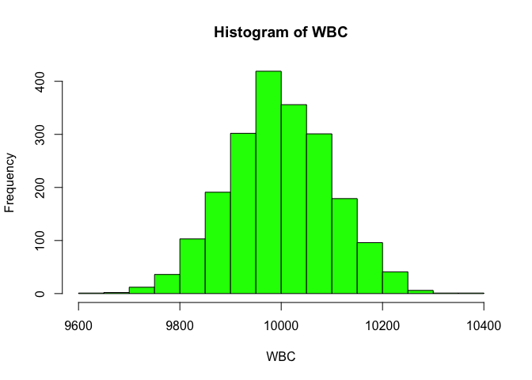

    sum(WBC >=10000)/N

    ## [1] 0.4836346

Absolute neutrophil cell count is more than 5000 when there is severe
infection

    ANC <- rpois(N,5)*1000 
    index2 <- which(ANC ==0)
    ANC[index2] <-ANC[index2] + 1300
    hist(ANC,col = "purple")

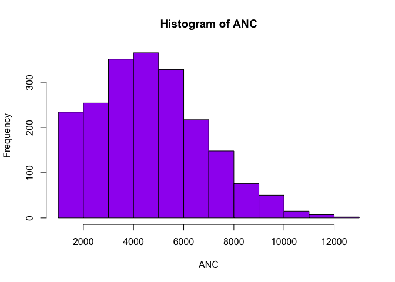

    sum(ANC >=5000)/N

    ## [1] 0.5901319

We are simulating the infection\_type variable before diagnosis. After
that we will reverse engineer the diagnosis veriable from it.
infection\_type have three values severe bacterial infection(SBI)- count
139 ,Nondefinative severe bacterial infection(Nondef\_SBI)- count 217
and non bacterial infection(No\_BI)- count 1691. We are first
constructing a data frame and then adding a new column.

    df <- data.frame(age, sex,Temperature, Febrile_family_member, YOS, PCT, CRP, WBC, ANC)
    df$infection_type <- factor(rep("No_BI",nrow(df)),levels = c("SBI","Nondef_SBI", "No_BI"))
    df$infection_type <-as.factor(ifelse(df$PCT >=0.3 & df$WBC >=11000 |df$CRP >=20,  "SBI", as.character(df$infection_type)))
    df$infection_type <- as.factor(ifelse(df$PCT< 0.29  & df$PCT >0.24 , "Nondef_SBI", as.character(df$infection_type)))
    table(df$infection_type)

    ## 
    ##      No_BI Nondef_SBI        SBI 
    ##       1664        223        160

    require(dplyr)
    df$diagnosis1 <-factor(rep("Non_BI",nrow(df)),levels=c("UTI","gastroenteritis", "meningitis","Bacteremia","Pneumonia","Non_BI"))
    df$diagnosis1 <-as.factor(ifelse(df$infection_type=="SBI",sample(c("UTI","gastroenteritis", "meningitis","Bacteremia"), nrow(df %>% filter(infection_type=="SBI")), replace=TRUE, prob=c(0.83, 0.02,0.06,0.09)) ,as.character(df$diagnosis1)))
    df$diagnosis1 <-as.factor(ifelse(df$infection_type=="Nondef_SBI",sample(c("UTI","Pneumonia"), nrow(df %>% filter(infection_type=="Nondef_SBI")), replace=TRUE, prob=c(0.80, 0.20)),as.character(df$diagnosis1)))
    sum(is.na(df$infection_type))

    ## [1] 0

    table(df$diagnosis1)

    ## 
    ##      Bacteremia gastroenteritis      meningitis          Non_BI 
    ##               6               6              17            1664 
    ##       Pneumonia             UTI 
    ##              40             314

##### Adding NA to WBC and CRP variables

There will be 25 missing value in WBC

    df$WBC[sample(1:length(df$WBC),25)] <-NA
    sum(is.na(df$WBC)) # checking the number of NAs

    ## [1] 25

Therewill be 10 missing vale in CRP

    df$CRP[sample(1:length(CRP),10)] <-NA
    sum(is.na(df$CRP)) # checking the number of NAs

    ## [1] 10

#### Analysis

**Making age group**

    df$age.level <- factor(rep("<= 30",nrow(df)), ordered = TRUE, levels = c("=< 30",">30")) 
    df$age.level[df$age <= 30] <- "=< 30"
    df$age.level[df$age >30] <- ">30"

    age.groups <- table(df$age.level)
    percent.labels.age <-round(100*age.groups/sum(age.groups),1 )
    pielabels <- paste(percent.labels.age,"%",sep = "")
    pie(age.groups, main = "Pie Chart for different age groups",col= rainbow(length(age.groups)),labels = pielabels, cex= 0.8)
    legend("topright",c("Age >30","Age =< 30"),cex = 0.8, fill = rainbow(length(age.groups)))

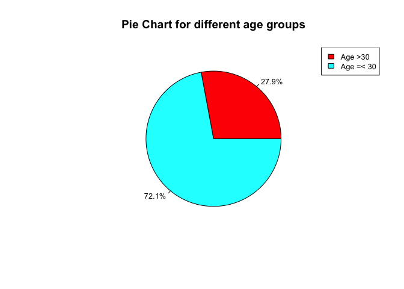

  **Distribution of age among different infection\_type group**  
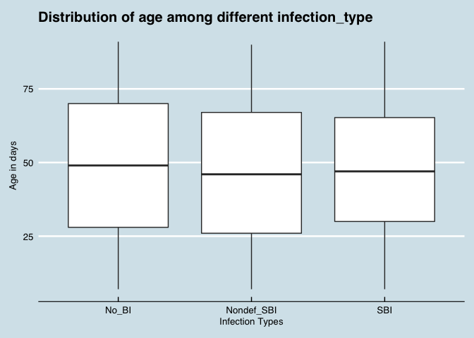
    **Distribution of PCT among different infection\_type group**
 
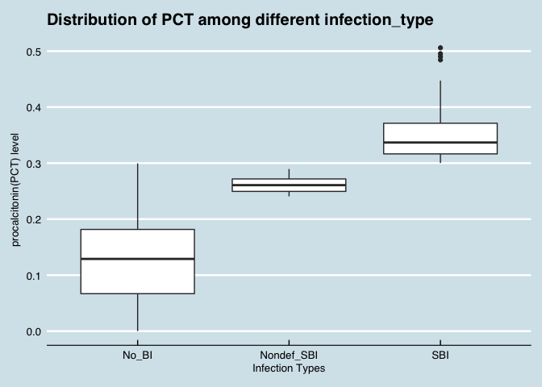

  **Distribution of WBC among different infection\_type group**  
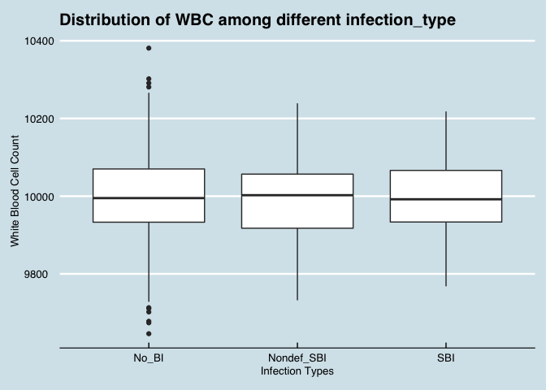

  **Distribution of CRP among different infection\_type group**  
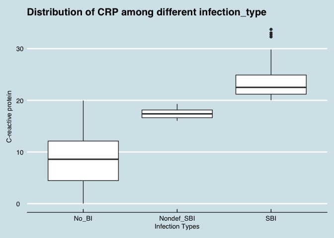

  **Distribution of ANC among different infection\_type group**  
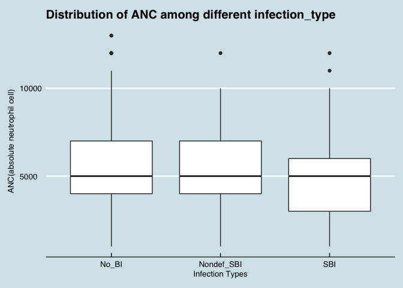

 

##### Correlation

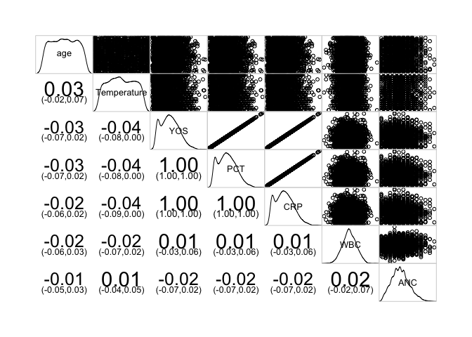

##### Regression

As our response variable, infection\_type has more than 2 categories we
will be using multinomial regression

    library("nnet")
    mod1 <- multinom(infection_type ~ PCT + WBC+ CRP+ YOS, data = df)

    ## # weights:  18 (10 variable)
    ## initial  value 2210.407925 
    ## iter  10 value 385.043745
    ## iter  20 value 301.689110
    ## iter  30 value 268.481306
    ## iter  40 value 263.200324
    ## iter  50 value 258.473709
    ## iter  60 value 256.352910
    ## iter  70 value 255.542727
    ## iter  80 value 255.330642
    ## iter  90 value 255.212314
    ## iter 100 value 255.143215
    ## final  value 255.143215 
    ## stopped after 100 iterations

    summary(mod1)

    ## Call:
    ## multinom(formula = infection_type ~ PCT + WBC + CRP + YOS, data = df)
    ## 
    ## Coefficients:
    ##            (Intercept)        PCT           WBC        CRP       YOS
    ## Nondef_SBI   -7.802771 0.01160503 -0.0008282067  0.7735914 0.3867957
    ## SBI        -334.577877 0.21187493 -0.0015472423 14.1235828 7.0617914
    ## 
    ## Std. Errors:
    ##             (Intercept)          PCT          WBC          CRP
    ## Nondef_SBI 2.370962e-05 8.073483e-04 1.092724e-04 5.381784e-02
    ## SBI        1.435168e-06 5.188087e-07 6.600937e-05 3.458379e-05
    ##                     YOS
    ## Nondef_SBI 2.690892e-02
    ## SBI        1.729189e-05
    ## 
    ## Residual Deviance: 510.2864 
    ## AIC: 522.2864

    exp(coef(mod1))

    ##              (Intercept)      PCT       WBC          CRP         YOS
    ## Nondef_SBI  4.086012e-04 1.011673 0.9991721 2.167537e+00    1.472256
    ## SBI        4.950785e-146 1.235993 0.9984540 1.360799e+06 1166.533015

##### Odds ratios

    exp(coef(mod1))

    ##              (Intercept)      PCT       WBC          CRP         YOS
    ## Nondef_SBI  4.086012e-04 1.011673 0.9991721 2.167537e+00    1.472256
    ## SBI        4.950785e-146 1.235993 0.9984540 1.360799e+06 1166.533015

##### Interpretation

-   Model execution output shows some iteration history and includes the
    final negative log-likelihood 256.694628. This value is multiplied
    by two as shown in the model summary as the Residual Deviance.

-   The summary output has a block of coefficients and another block of
    standard errors. Each blocks has one row of values corresponding to
    one model equation. In the block of coefficients, we see that the
    first row is being compared to infection\_type = “Nondef\_SBI” to
    our baseline prog = “No\_BI” and the second row to infection\_type =
    “SBI” to our baseline prog = “No\_BI”.

-   A one-unit increase in WBC decrease the log odds of being in
    Nondef\_SBI vs. No\_BI by 0.001128434

-   A one-unit increase in WBC decreases the log odds of being in
    SBI vs. No\_BI by 0.001270790

-   A one-unit increase in PCT increase the log odds of being in
    Nondef\_SBI vs. No\_BI by 0.01143585

-   A one-unit increase in PCT increases the log odds of being in
    SBI vs. No\_BI by 0.23879609

Calculation Z score and p-value

    z <- summary(mod1)$coefficients/summary(mod1)$standard.errors
    z

    ##             (Intercept)          PCT        WBC          CRP          YOS
    ## Nondef_SBI    -329097.3     14.37426  -7.579284     14.37426     14.37426
    ## SBI        -233128061.3 408387.38538 -23.439739 408387.38536 408387.38536

    p <- (1 - pnorm(abs(z), 0, 1))*2
    p

    ##            (Intercept) PCT          WBC CRP YOS
    ## Nondef_SBI           0   0 3.463896e-14   0   0
    ## SBI                  0   0 0.000000e+00   0   0

Above method adopted from
<https://stats.idre.ucla.edu/r/dae/multinomial-logistic-regression/>

As the predictor variables in mod1 are highly corelated , we remove few
of the the highly correlated.

    mod2 <- multinom(infection_type~ PCT+ WBC+ANC, data = df)

    ## # weights:  15 (8 variable)
    ## initial  value 2221.394048 
    ## iter  10 value 432.269719
    ## iter  20 value 305.784777
    ## iter  30 value 285.514841
    ## iter  40 value 269.140425
    ## iter  50 value 268.230496
    ## iter  60 value 267.912827
    ## iter  70 value 267.409617
    ## iter  80 value 267.035559
    ## iter  90 value 266.706679
    ## final  value 266.706090 
    ## converged

    summary(mod2)

    ## Call:
    ## multinom(formula = infection_type ~ PCT + WBC + ANC, data = df)
    ## 
    ## Coefficients:
    ##            (Intercept)       PCT           WBC           ANC
    ## Nondef_SBI   -9.602742  64.16765 -0.0006382620 -3.686347e-06
    ## SBI        -103.453284 383.16753 -0.0008328894 -2.546678e-05
    ## 
    ## Std. Errors:
    ##             (Intercept)          PCT          WBC          ANC
    ## Nondef_SBI 2.830648e-09 6.849822e-10 2.820071e-05 4.977709e-05
    ## SBI        7.745441e-09 2.372514e-09 7.787106e-05 1.418727e-04
    ## 
    ## Residual Deviance: 533.4122 
    ## AIC: 549.4122

    exp(coef(mod2))

    ##             (Intercept)           PCT       WBC       ANC
    ## Nondef_SBI 6.754331e-05  7.373207e+27 0.9993619 0.9999963
    ## SBI        1.177090e-45 2.555904e+166 0.9991675 0.9999745

    exp(coef(mod1))

    ##              (Intercept)      PCT       WBC          CRP         YOS
    ## Nondef_SBI  4.086012e-04 1.011673 0.9991721 2.167537e+00    1.472256
    ## SBI        4.950785e-146 1.235993 0.9984540 1.360799e+06 1166.533015

    z1 <- summary(mod2)$coefficients/summary(mod2)$standard.errors
    z1

    ##             (Intercept)          PCT       WBC        ANC
    ## Nondef_SBI  -3392418356  93677831057 -22.63283 -0.0740571
    ## SBI        -13356668506 161502717534 -10.69575 -0.1795045

    p1 <- (1 - pnorm(abs(z1), 0, 1))*2
    p1

    ##            (Intercept) PCT WBC       ANC
    ## Nondef_SBI           0   0   0 0.9409650
    ## SBI                  0   0   0 0.8575416

##### Fisher exact test

In fisher test null hypothesis is that two variable are independent. So
a high p value means that the two variables are likely to be
independent.

-   Age level and infectiontype

<!-- -->

    fisher.test(table(df$sex,df$infection_type))

    ## 
    ##  Fisher's Exact Test for Count Data
    ## 
    ## data:  table(df$sex, df$infection_type)
    ## p-value = 0.4368
    ## alternative hypothesis: two.sided

-   Febrile\_family\_member and infection type

<!-- -->

    fisher.test(table(df$Febrile_family_member,df$infection_type))

    ## 
    ##  Fisher's Exact Test for Count Data
    ## 
    ## data:  table(df$Febrile_family_member, df$infection_type)
    ## p-value = 0.7949
    ## alternative hypothesis: two.sided

-   Age level and infectiontype

<!-- -->

    fisher.test(df$ age.level, df$infection_type)

    ## 
    ##  Fisher's Exact Test for Count Data
    ## 
    ## data:  df$age.level and df$infection_type
    ## p-value = 0.9116
    ## alternative hypothesis: two.sided

### Conclusion

From the above analysis we can come to a conclusion that as a predictor
of severe bacterial infection procalcitonin level acts much better than
other predictor variable like White Blood Count(WBC), C-reactive
Protein(CRP), absolute neutrophil cell(ANC), YOS score.In our final
model we see P-value is 0 for PCT. Search on internet and book reviews
shows that p-value very near to 0 is sometimes given as 0 by stastical
program(<https://stats.stackexchange.com/questions/15223/how-to-interpret-p-values-of-0-or-1>).
So we can say in predicting severe bacterial infection and non definite
severe bacterial infection PCT is a significant predictor. Correlation
test reveals that the variable YOS score, PCT and CRP are highly
correlated(coef 1). So taking out any one of them increase the model
performance. FIsher test shows that the infection\_type are independent
of sex, age level, febrile family members.
